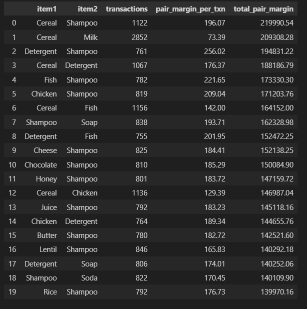
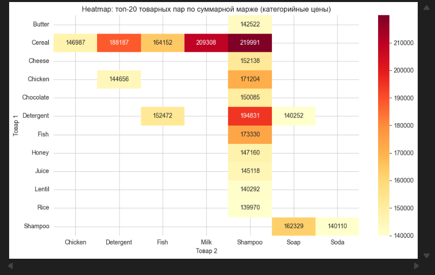
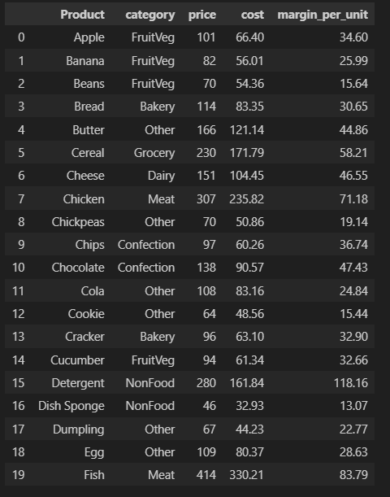
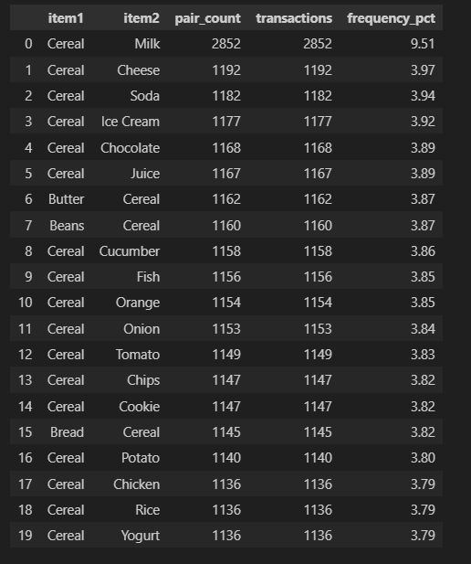

# Анализ маржинальности товарных пар (retail-basket-pairs)  
## Проект для портфолио BI‑аналитика:  
анализ товарных пар с расчётом маржи, маржинальных рангов и heatmap на основе Retail Transaction Dataset.  

## Цель проекта  
Маркетинговый отдел понимает, какие товары покупают вместе, но хочет узнать ещё:  
- Какие пары дают наибольшую суммарную маржу;  
- Какие комбинации товаров стоит выносить в комплектные промо‑предложения;  
- Как меняется топ‑пар, если смотреть не только на частоту, но и на прибыль.  

! В базовом проекте [promo-pairs-margin-ranking](https://github.com/irochkairochka/promo-pairs-margin-ranking) реализован анализ по частоте пар.  
! Этот проект развивает тему: добавлены цены, себестоимость, маржа и visual heatmap топ‑20 пар.  

## Данные  
Используется Retail Transaction Dataset (Kaggle, автор bkcoban):  
- 30 000 транзакций розничной сети;  
- описывают структуру чеков;  
- не содержат реальных клиентов или магазинов;  
- распространяются свободно для образовательных целей.  

##### Столбцы исходного датасета:  
`TransactionID` — уникальный идентификатор транзакции;  
`CustomerID` — идентификатор клиента;  
`Products` — строка со списком товаров в корзине, разделённых запятыми;  
`Timestamp` — дата и время покупки.  

### Важный момент:  
В описании набора данных указано, что это synthetic retail data: транзакции сгенерированы специально для аналитики, не основаны на реальных чеках и не содержат персональных данных.  
Это позволяет использовать датасет в открытых образовательных и портфельных проектах без нарушения требований по защите персональных данных.  

В этом проекте создаётся дополнительный синтетический прайс‑лист с категориями, ценами и наценками:  
`Product` — наименование товара;  
`category` — категория товара (Dairy, Bakery, Meat, NonFood и др.);  
`price` — розничная цена (в условных единицах);  
`cost` — себестоимость;  
`margin_per_unit` — маржа с единицы товара.  

Цены и маржа моделируются по категориям, чтобы получить реалистичные уровни наценки (молочка, мясо, non‑food и др. — разные диапазоны).  

### Структура проекта  

##### Основные элементы проекта:  

`data/products.csv` — исходный датасет (30000 записей)  
`data/products_price_margin.csv` — сгенерированный прайс‑лист с категориями, ценой и маржой  
`notebooks/01_pairs_margin_heatmap.ipynb` — файл Jupiter Notebook для VS Code/браузера с исследованиями  
`screenshots/top-20-pairs-margin.jpg` — таблица топ-20 пар по суммарной маржинальности  
`screenshots/heatmap-margin.jpg` — heatmap пересечения товаров топ-20 пар и их маржинальности  
`screenshots/products-price-margin.jpg` — таблица прайс‑листа с категориями и маржей  
`screenshots/best-20-pairs-margin.jpg` — таблица лучших 20 пар по частой встречаемости  
`README.md` — описание проекта, целей, данных и результатов (этот файл)  
`requirements.txt` — список Python‑зависимостей.  

### Подход и методы анализа  

##### Основные шаги:  

###### Загрузка и первичный EDA:  
- Загрузка датасета, проверка типов и пропусков;  
- Разбор столбца Products в список товаров (product_list);  
- Расчёт размера корзины (basket_size) для каждой транзакции.  

###### Генерация товарных пар (как в базовом проекте):  
- Для каждой корзины строятся все комбинации товаров по два с помощью itertools.combinations;  
- Товары внутри пары сортируются, чтобы (A, B) и (B, A) считались одной комбинацией.  

###### Моделирование цен и маржи по категориям:  
- Определение категорий товаров по ключевым словам в названии;  
- Для каждой категории задаются диапазоны цены и наценки;  
- Генерация прайс‑листа с price, cost и margin_per_unit для каждого товара.  

###### Расчёт маржи по товарным парам:  
- Джойн прайс‑листа к товарам в каждой паре (item1 и item2);  
- Расчёт pair_margin_per_txn — маржа пары за одну совместную покупку;  
- Расчёт total_pair_margin — суммарная маржа пары по всем транзакциям;  
- Ранжирование по total_pair_margin и выделение топ‑20 пар.  

###### Визуализация:  
- Таблица топ‑20 пар по суммарной марже;  
- Heatmap seaborn.heatmap с товарами и их маржинальностью в топ‑20 парах.  

### Используемый стек:  
- Python: pandas, numpy, itertools;  
- Визуализация: seaborn, matplotlib;  
- Среда: Jupyter Notebook (выполняется в VS Code).  

### Основные результаты  

Пример ключевых наблюдений (по результатам ноутбука):  

  

Топ‑20 пар по суммарной марже показывает интересный результат: лидируют комбинации высокомаржинальных товаров с товарами повседневного спроса (например, Cereal + Shampoo, Detergent + Fish), а не просто самые частые пары.  
Пара Cereal + Milk, которая лидирует по частоте в базовом проекте [promo-pairs-margin-ranking](https://github.com/irochkairochka/promo-pairs-margin-ranking), остаётся в топе, но уступает комплектам с более дорогими и высокомаржинальными товарами.  

  

Heatmap позволяет визуально увидеть «горячие» клетки — пары, которые одновременно популярны и высокомаржинальны, и поэтому интересны для промо‑наборов.

  

Таблица прайс‑листа показывает категоризацию товаров и распределение цен и наценок по категориям.

  

Таблица лучших 20 пар по самой частой встречаемости с количеством транзакций пары.  

### Запуск ноутбука:  

1. Открыть папку проекта в VS Code.  
2. Убедиться, что установлены расширения Python и Jupyter.  
3. Выбрать интерпретатор Python, в котором установлены зависимости.  
4. Открыть ноутбук notebooks/01_pairs_margin_heatmap.ipynb и выполнить ячейки по порядку.  

### Возможные направления развития:  

План дальнейшего развития анализа:  
- сравнить топ‑10 по частоте vs топ‑10 по марже в виде сравнительной таблицы;  
- добавить симуляцию скидок и расчёт маржи с учётом промо‑цен;  
- сравнить AOV (средний чек) и маржу чеков с выбранной парой vs без неё;  
- построить SQL‑версию расчётов и сравнить подходы Python vs SQL.  

## 📧 Контакты  
Разработчик: Ирина Васильевна  
📧 Email: irochkavinokurova@mail.ru  
📱 WhatsApp/Telegram: +7 (919) 128-29-95  

## 📄 Лицензия  
Проект использует открытый датасет Retail Transaction Dataset от Kaggle.com. Код распространяется свободно для образовательных целей.
